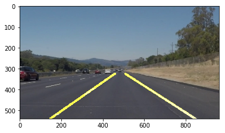

Finding Lane Lines on the Road
==============================

**Finding Lane Lines on the Road**

The goals / steps of this project are the following: \* Make a pipeline that
finds lane lines on the road \* Reflect on your work in a written report

### Reflection

### 1. Describe your pipeline. As part of the description, explain how you modified the draw_lines() function.

My pipeline consisted of following steps and starts with feeding the original
image to step 1:

1.  Filter the image for white and yellow colors. White color filtering is easy
    with just RGB but for yellow I convert the image to hsv using cv2 functions.
    The two filtered images are then added to create a weighted sum image (three
    channel RGB).

1.  The weighted sum image is then converted to gray scale (single channel).

    

2.  The gray scale image is blurred using a Gaussian Kernel of size 5 in order
    to remove noise.

1.  The Blurred gray image is put through the canny edge detection kernel with
    lower and upper thresholds of 50 and 150. This gets rid of all data in the
    image that is not within the upper and lower thresholds – provides edges.

1.  A trapezoidal area is defined that only covers the lane width. The image is
    from step 4 is then masked. Anything that is outside the trapezoidal area is
    removed.

1.  This masked image now contain only edges in the trapezoidal area. This image
    is then passed through a Hough transform which provides a list of line
    objects

    1.  This is the critical step in the sequence where the lines created in
        step 6 and an empty image is passed to draw lines that best represent
        the left and right side lane markings. The details of line drawing is
        explained later.

### [./media/image7.png](./media/image7.png)

1.  The line drawn image mask is overlayed on top of the original image that was
    fed to step 1.

**Brief on Draw_Lines() function**

The draw lines function consisted of following steps and takes in the lines
provided by Hough_lines function:

1.  Set a slope threshold. This was decided based on some trial and error to be
    0.5

2.  Based on lines provided to the function, reject lines that fall in the
    following criteria:

    1.  Above the slope threshold

    2.  Negative slope lines are for right side lane and positive slope lines
        are for left lane

    3.  The line x coordinate needs to be to the left or right side of the
        middle of the image based on whether the coordinate is for left or right
        lane

3.  The x1, x2 and y1,y2 coordinates obtained in step 2 are concatenated to be
    fed to a polyfit numpy function which does linear regression to provide an
    average slope m and intercept b values which will be used to draw lines.

4.  Based on whether the criteria in 2 allowed the arrays for left and right
    lines to fill up, the last step is to actually draw the lines on the empty
    image using m and b obtained in step 3. This image is returned to
    Hough_lines function.

>   Here are some results:

### 2. Identify potential shortcomings with your current pipeline

Currently there are many shortcomings in this algorithm. Following scenarios are
not considered:

\- Light conditions – in dark conditions, the image will have to be filtered
differently

\- Curves – currently the draw lines function only draws straight lines. For
aggressive curves, this will need to be modified.

\- There are situations where there are no lane markings for a period of time,
this is where this function will fail to provide lane lines.

\- Presence of other cars might obstruct the view of the camera from the lane
markings. This is not handled.

### 3. Suggest possible improvements to your pipeline

There are various improvements possible as we progress in the course:

-   Consider light conditions

-   Consider curves

-   Ability to distinguish between cars and lanes
