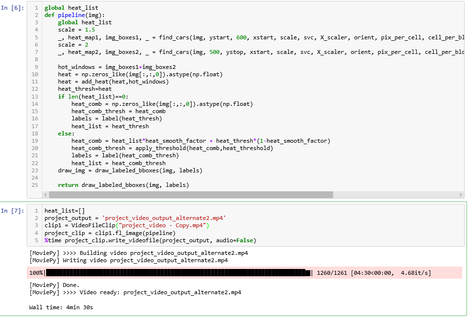
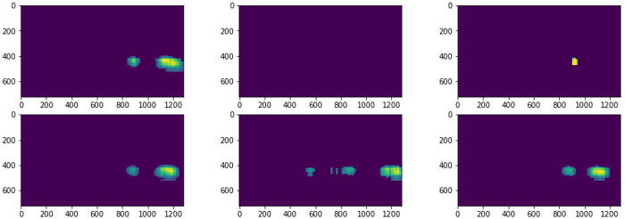
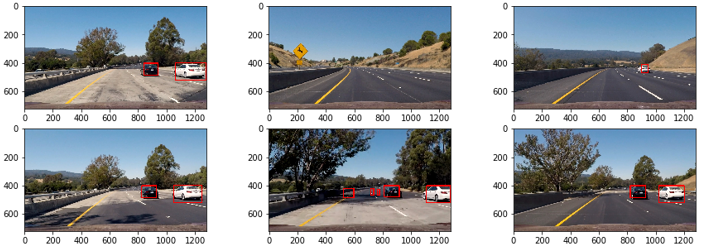
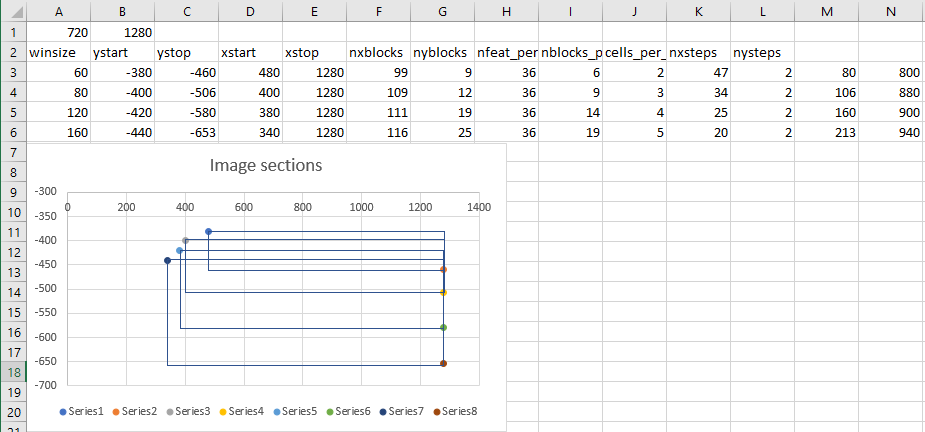
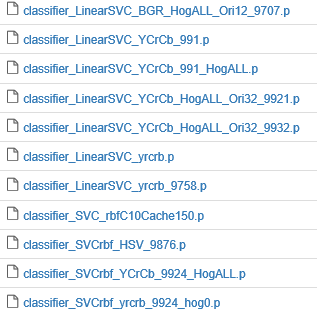

**Vehicle Detection Project**

The goals / steps of this project are the following:

-   Perform a Histogram of Oriented Gradients (HOG) feature extraction on a
    labeled training set of images and train a classifier Linear SVM classifier

-   Optionally, you can also apply a color transform and append binned color
    features, as well as histograms of color, to your HOG feature vector.

-   Note: for those first two steps don't forget to normalize your features and
    randomize a selection for training and testing.

-   Implement a sliding-window technique and use your trained classifier to
    search for vehicles in images.

-   Run your pipeline on a video stream (start with the test_video.mp4 and later
    implement on full project_video.mp4) and create a heat map of recurring
    detections frame by frame to reject outliers and follow detected vehicles.

-   Estimate a bounding box for vehicles detected.

Rubric Points
-------------

### Here I will consider the rubric points individually and describe how I addressed each point in my implementation.

### Video Implementation

#### 1. Provide a link to your final video output. Your pipeline should perform reasonably well on the entire project video (somewhat wobbly or unstable bounding boxes are ok as long as you are identifying the vehicles most of the time with minimal false positives.)

Here's a [link to my video result](./project_video.mp4):

<https://youtu.be/D4QSVajtDyc>

1.  Describe how (and identify where in your code) you implemented some kind of
    filter for false positives and some method for combining overlapping
    bounding boxes.

The code shown above is where I take a recent list of hot windows that have been
estimated based on sliding window search and a trained classifier. Steps to
eliminate false positives and multiple overlapping bounding boxes are:

1.  Apply a threshold to the current hot window list

2.  Add the current set of hot windows to a list

3.  I chose to smooth out the multiple windows based on 5 previous frames. This
    is done with a heat_smooth_factor (0.5) as shown above.

4.  After smoothing the window position, I apply the threshold to eliminate the
    overlapping and false positive windows.

5.  The windows are then drawn on the image with draw_labeled_bboxes.

Below are the heatmaps achieved with my classifier

Below are the bounding boxes drawn based on the heatmap and label function:

### HOG (Histogram of Oriented Gradients):

My get_hog_features is implemented in Functions.py line 50 to 63. During
training, hog features are extracted using extract_features function lines 91 to
100 in functions.py. During video pipeline process, find_cars calls
get_hog_features directly to extract hog features once before subsampling them
as per sliding window function coordinates.

-   To start of with, I tested various LinearSVC and SVC with rbf trainings
    using only 1 channel fed to the HOG feature extractor function hog.sdf

    -   When I trialed only channel 0, I got very sketchy performance with
        actual vehicle detection.

    -   With 2 channels, I got only \~50% of the detections correct.

-   Based on all the discussion on slack and my own tests, only feeding all the
    channels to extract hog features gave me above 99% test accuracy during
    training.

-   I also tested using orientations setting of 9, 12 and 32.

    -   For all orient settings there was no substantial improvement in the test
        accuracy.

    -   But during video pipeline runs, orient of 9 missed out detecting the
        black car (in combination with using only 1 channel for hog) that comes
        into the frame. And as I increased the orient alone while sticking with
        single channel, the accuracy of recognizing the black car improved but
        not entirely.

    -   Eventually in combination with feeding all the channels to hog, orient
        of 32 proved to be the most reliable for video pipeline.

-   I did not test a lot of variations of pix_per_cell and cell_per_block.
    Initially all my testing was done at pix_per_cell of 8. The video processing
    time for this was 11 minutes with finding_cars function. When the
    pix_per_cell was upped to 16, the time to process video was 4min 30 sec. But
    the difference in quality of vehicle detection was not substantial. I
    settled on pix_per_cell of 16. This variable has direct impact on the
    nxblocks and nyblocks variables (I tried this in the excel sheet first to
    gauge impact – the extract from the sheet is shown in the sliding window
    section).

    -   I left cell_per_block at 2 for overlap of 75% while sliding windows
        across the image.

### Sliding Window:

This is where I spent a lot of time. I initially wanted to see how fast the
video pipeline will be if I implemented the slide_window and search_window
algorithms where the hog features are extracted for each image snippet. The code
for this is now included in the submission. Here is an extract:

The video processed with this method is pretty much the same as what I got from
my final find_cars function but took almost 1hr 30 minutes to process!!!

In this method as can be seen, I am getting a list of windows for sections of
the images shown below in an excel chart I made:

This was done to work out exact dimensions of the image to be fed to the
slide_window function. This excel sheet provided with all the required ystart,
ystop and xstart, xstop variable values along with a visualization of which
sections of the image are being used for feature extraction. The window list
extracted from this is fed to the search_window to obtain the hot_window list
which is then processed for rejecting false positives and duplicate detections
using the label function.

### Discussion

#### 1. Briefly discuss any problems / issues you faced in your implementation of this project. Where will your pipeline likely fail? What could you do to make it more robust?

Mostly time was spent trying to improve the efficiency of the algorithm to speed
up the pipeline. Initially the same result took about 1.5 hrs. using the sliding
window and search_window functions! The efficiency was improved by using the
find_cars function where the HOG features are extracted beforehand for the whole
image and later subsampled while prediction is being done.

Another substantial problem was whether to use the YCrCb or RGB/BGR color
spaces. Both the color spaces have their pluses and minuses. Eventually based on
many hrs spent training and retraining, I decided to go with YCrCb although BGR
color space was a very close second.

I also tested SVC with rbf and Linear SVC classifiers. The SVC takes a lot
longer to process the image as compared to the LinearSVC. I settled on LinearSVC
for speed and efficiency despite of slightly lower test accuracy.

These pickle dumps are from various permutations and combinations I trialed.

I also tested some variations of smoothing out the hot windows before settling
on the implementation as given in the Video pipeline.

Eventually, after I had completed the vehicle detection portion, I fed the video
to my previous project for lane detection. The link shared above is the result
of this.

My next task is to use the LeNet neural network to train the model and see how
that performs as compared to LinearSVC.
